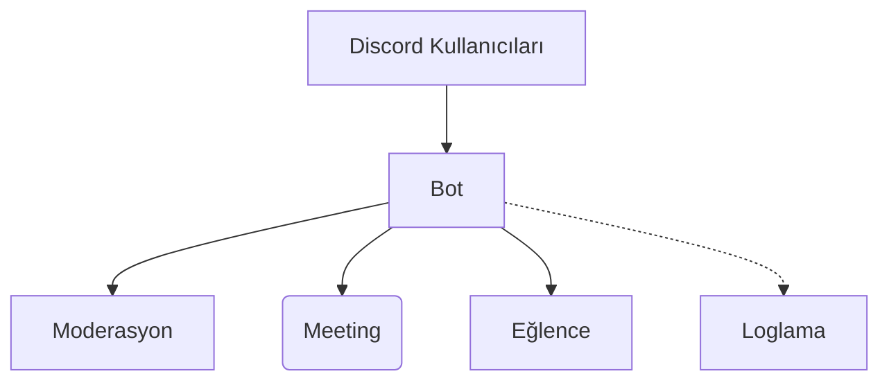

<!-- Animated Banner -->
<p align="center">
  
</p>

<p align="center">
  
</p>

<h1 align="center">MeetyBot</h1>
<p align="center"><i>Açık kaynak, özelleştirilebilir ve profesyonel toplantı & moderasyon botu.<br>
<strong>SafakiGamer</strong> tarafından geliştirildi!</i></p>

<p align="center">
  <a href="https://github.com/MertTunaGuralp/MeetyBot/actions">
    </a>
  <a href="https://github.com/MertTunaGuralp/MeetyBot/stargazers">
    </a>
  <a href="https://github.com/MertTunaGuralp/MeetyBot/issues">
    </a>
  
  
</p>

---

## 🚦 Neden MeetyBot?

- **Her Seviyeden Topluluk İçin Uygun:** Wecordy ve Discord sunucularındaki toplantı ve etkinlik ihtiyacına doğrudan çözüm.
- **%100 Açık Kaynak & Geliştirilebilir:** Esnek ve modüler yapısı ile kolayca katkı sunabilir ve özelleştirebilirsiniz.
- **Kapsamlı Moderasyon & Eğlence Komutları:** Sadece bot değil, topluluk yönetimi için mükemmel asistan.
- **Aktif Geliştirici & Topluluk Desteği:** Sorularınız için topluluk desteği ve hızlı iletişim.

---

## ⚡ Başlarken

### 1. **Botu Klonlayın:**
```bash
git clone https://github.com/MertTunaGuralp/MeetyBot.git
cd MeetyBot
```

### 2. **Gereksinimleri Yükleyin:**
```bash
npm install
```

### 3. **Yapılandırma Dosyasını Oluşturun:**
`config.example.json` dosyasını `config.json` olarak kopyalayın ve düzenleyin:
```bash
cp config.example.json config.json
```
Gerekli alanı doldurun:

```json
{
  "token": "BURAYA_DISCORD_BOT_TOKENINIZI_YAZIN",
  "prefix": "!"
}
```
### 4. **Botu Başlatın:**
```bash
npm start
```

#### ✅ Alternatif Kurulum Yöntemleri
- Docker ile kurulum için [buraya tıklayın](#docker-kurulumu)
- Heroku/Glitch desteği için yakında!

---

## 🎯 Komutlar & Özellikler

| Komut       | Açıklama                         | Yetki   |
|:--          |:---------------------------------|:--------|
| `!toplanti` | Toplantı planla & düzenle        | Admin   |
| `!anket`    | Anket başlat, oy toplama         | Herkes  |
| `!uyarı`    | Uyarı, susturma gibi moderasyon  | Mod     |
| `!yardım`   | Tüm komutları sıralar            | Herkes  |

> Daha fazla komut ve ayrıntılı tanımlar için `!yardım` yazabilirsiniz!

---

## 🖥️ Kullanım Demoları

<p align="center">
  
</p>

---

## 🏗️ Mimari & Geliştirici Notları


> Modern, ölçeklenebilir ve eklentiye uygun TypeScript mimarisi!

---

## 🤖 Docker Kurulumu

```bash
docker build -t meetybot .
docker run -e TOKEN=YOUR_BOT_TOKEN -e PREFIX=! meetybot
```

---

## 💡 SSS

- **Neden tokenimi gizli tutmalıyım?**  
  Herkese açık oynamayın, aksi halde botunuza izinsiz kişiler erişebilir!

- **Geri bildirim/öneri iletebilir miyim?**  
  Evet! Issue açmanız veya Pull Request göndermeniz yeterli.

---

## 🌐 Topluluk & Destek

- 📬 Sorularınız için Discord Topluluğumuz: [Discord Davet Linkiniz]
- 📢 Yenilikler ve Duyurular için Github Watch/Star Ekleyin
- 🧑‍💻 Geliştirici: [SafakiGamer profilini ziyaret et](https://github.com/SafakiGamer)

---

## 🗺️ Yol Haritası

- [x] Temel toplantı ve moderasyon komutları
- [ ] Otomatik rol atama sistemi (Yakında!)
- [ ] Web panel entegrasyonu
- [ ] Çoklu dil desteği

---

## 🎁 Katkı Sağlamak

1. Fork'la ve geliştir (en son ana dalı almayı unutma)
2. Yeni bir branch'te çalış
3. Değişikliği commit'le, pushla ve PR aç
4. Açıklama ekle ve review al!

Daha detaylı katkı dökümanı için: [CONTRIBUTING.md](CONTRIBUTING.md)

---

## 🙏 Teşekkür & Katkıda Bulunanlar

- SafakiGamer (Geliştirici ve yönetici)
- Tüm katkıcılarımıza teşekkürler!  
Katkıda bulunan olmak için PR gönderebilirsin!

---

## ⚖️ Lisans

> MIT License | © SafakiGamer & MeetyBot Contributors

<p align="center">
  
  
</p>
